<h1 align="center">🏬📈Desafio Serasa Experian!🚀⚡</h1>
<div align="center">
    Desafio Back-end, Java, Spring Boot.
</div>
<div align="center">
  
  
</div>

<h2> Descrição do Projeto </h2>

Objetivo: Criar um serviço do tipo API REST, para cadastro de pessoas com score e endereço. O serviço deve ser capaz de criar pessoa recebendo o CEP para obter os dados de endereço utilizando uma API externa, nesse projeto utlizei <a target="_blank" href="https://viacep.com.br/">ViaCep</a>.

<div>
  <h2> Tecnologias </h2>
  <a target="_blank" href="https://www.oracle.com/java/technologies/javase/jdk17-archive-downloads.html">📌- Java (17)  <br></a>
  <a target="_blank" href="https://www.h2database.com/html/main.html">📌- H2 Database  <br></a>
  <a target="_blank" href="https://spring.io/projects/spring-boot/">📌- Spring Boot  <br></a>
  <a target="_blank" href="https://docs.spring.io/spring-boot/docs/current/maven-plugin/reference/htmlsingle/">📌- Spring Maven  <br></a>
  <a target="_blank" href="https://docs.spring.io/spring-framework/reference/web/webmvc.html">📌- Spring MVC  <br></a>
  <a target="_blank" href="https://spring.io/projects/spring-data-jpa/">📌- Spring Data JPA  <br></a>
  <a target="_blank" href="https://springdoc.org/">📌- SpringDoc  <br></a>
  <a target="_blank" href="https://jwt.io/libraries?language=Java">📌- Token JWT  <br></a>
  <a target="_blank" href="https://spring.io/projects/spring-security/">📌- Spring Security  <br></a>

</div>
<div>
  <h2> Como Executar </h2>
</div>
✔ - Clone o projeto a partir deste repositório com o "git clone (link do projeto)". <br>
✔ - Caminhe até a pasta clonada. <br>
✔ - Abra na sua IDE e atualize as dependências do projeto. O IntelliJ IDEA exibe um ícone de notificação na parte direita do editor sugerindo Carregar as alterações e dependências do Maven feitas no projeto. <br>
✔ - Após atualizar as dependências, inicie o projeto utilizando Shift+F10 ou no modo Debug Shift+F9. <br>
✔ - Projeto iniciado com sucesso. <br>
O Swagger poderá ser visualizado em <a target="_blank" href="http://localhost:8080/swagger-ui/index.html"> Swagger  <br></a>
<div>
  <h2>API Endpoints </h2>
</div>
Observação a aplicação já vem com um Usuario ADMIN default pois Somente usuários ADMIN podem registrar, atualizar e excluir pessoas. Gere o token com ADMIN Através do token pode ser criado outros usuarios com Role de ADMIN ou USER. <br>
{
    "login": "admin",
    "password": "123"
}<br><br>
- Login ADMIN default <br><br>

```
http://localhost:8080/auth/login
{
    "login": "admin",
    "password": "123"
}
```

<br><br>
- Registrando Pessoa autenticado como ADMIN <br><br>

```
http://localhost:8080/auth/register
{
    "login": "wiliender",
    "nome": "wiliender",
    "password": "12345",
    "role": "ADMIN",
    "idade": "26",
    "cep": "13604025",
    "telefone": "19999231095",
    "score": "1000"
}
```
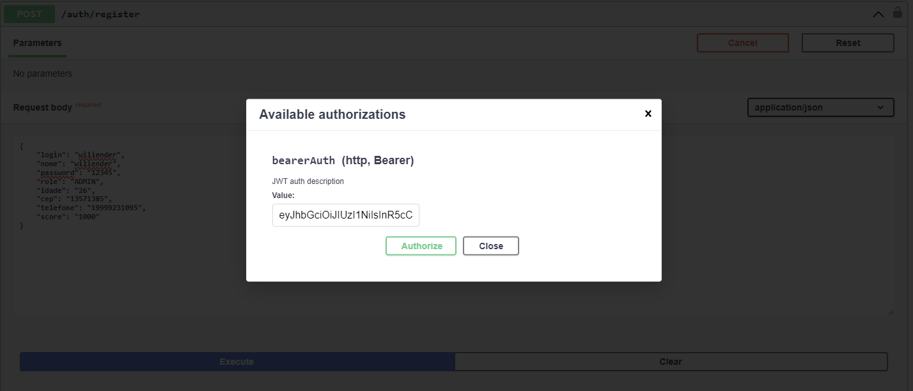
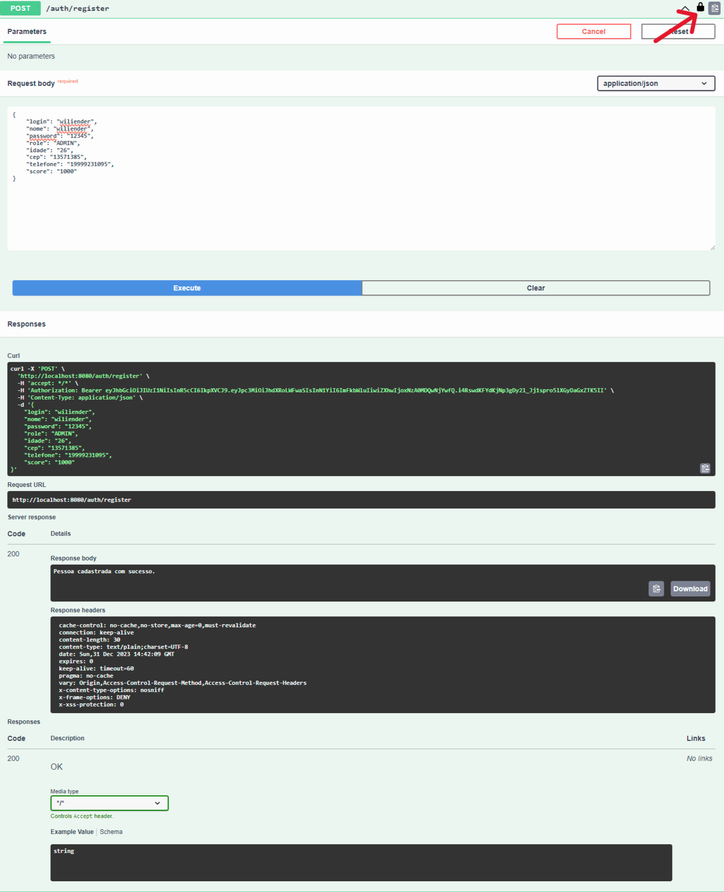
<br><br>
- Buscando Pessoa sem Filtro e com Filtro <br><br>

```
http://localhost:8080/auth/pessoa
```

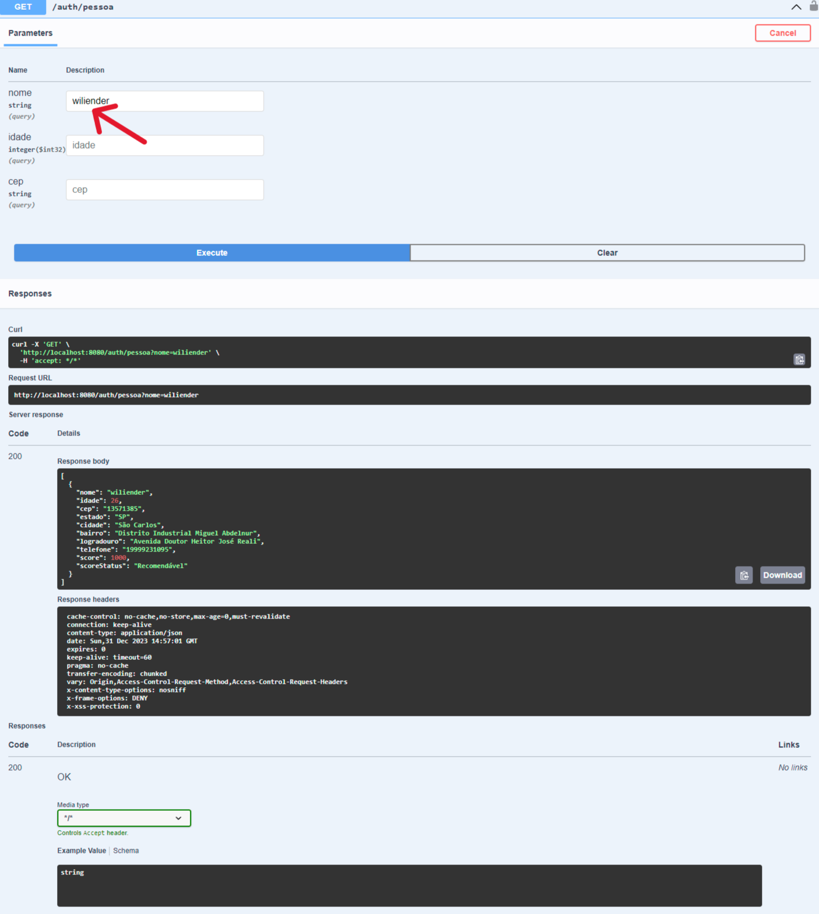
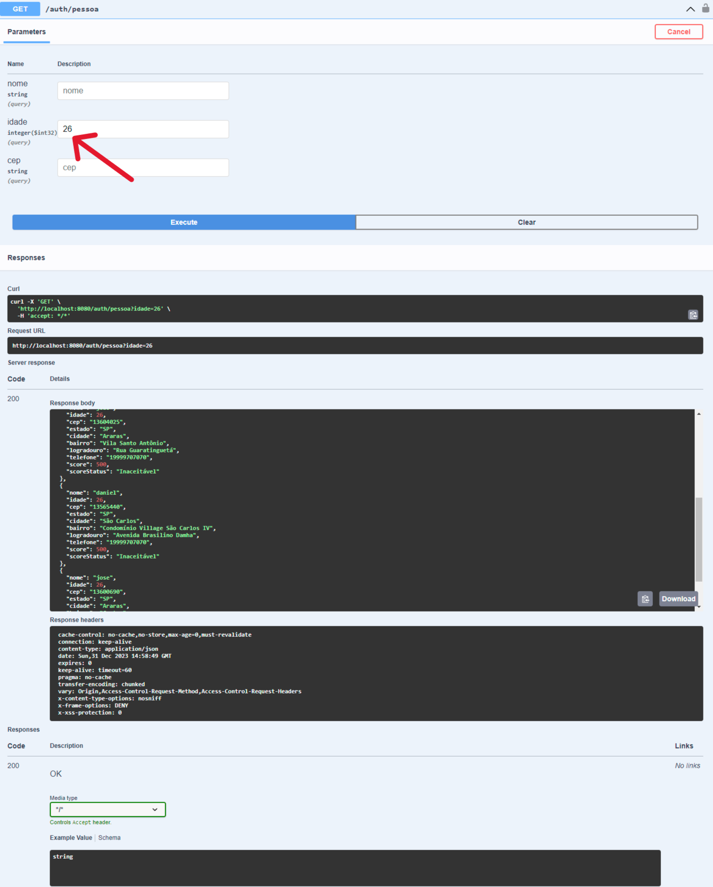

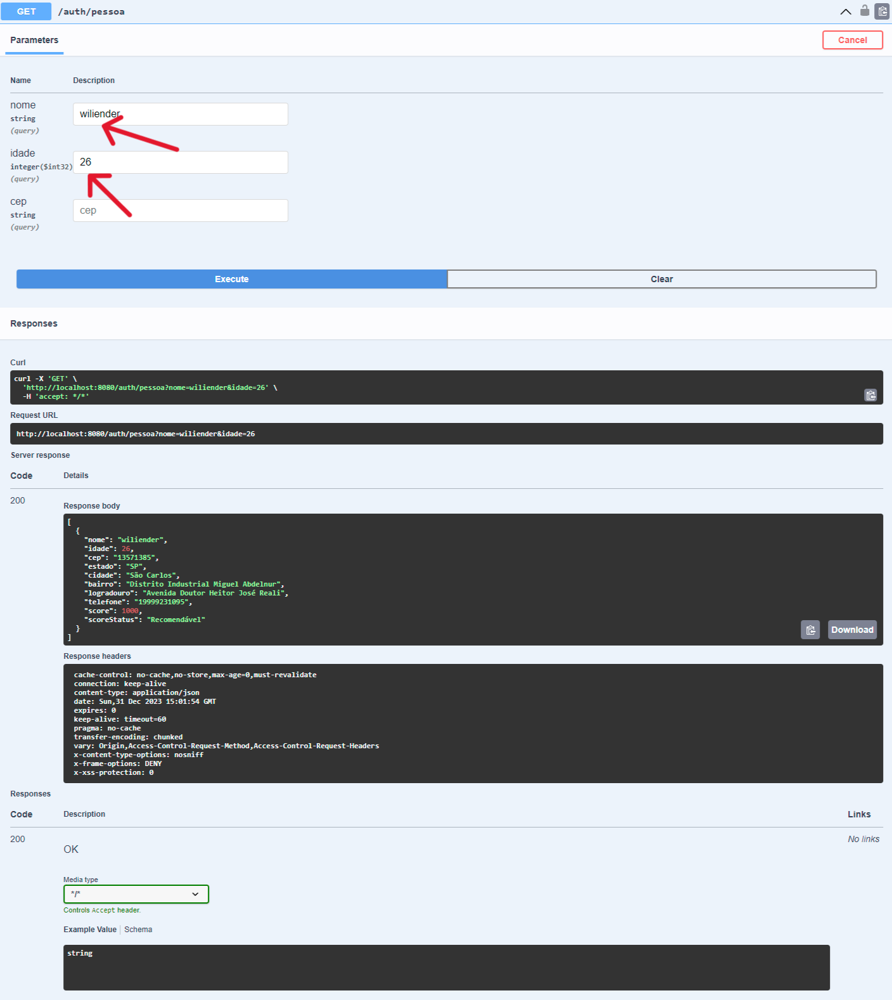
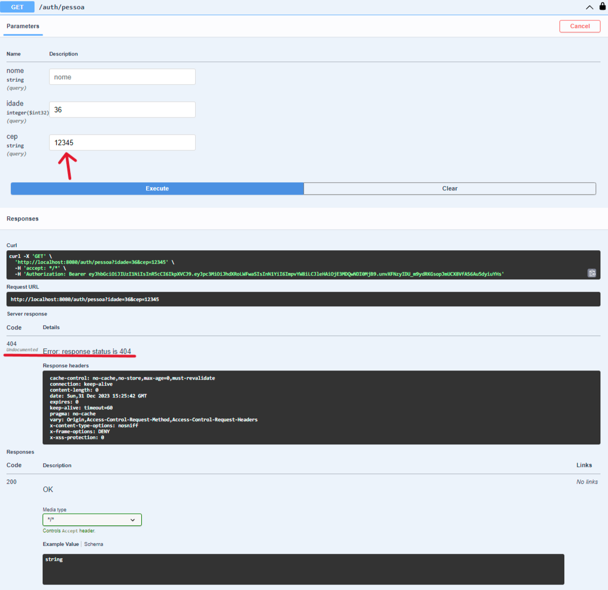
<br><br>
- Deletando Pessoa pelo login autenticado como ADMIN <br><br>

```
http://localhost:8080/auth/pessoa/{login}
```
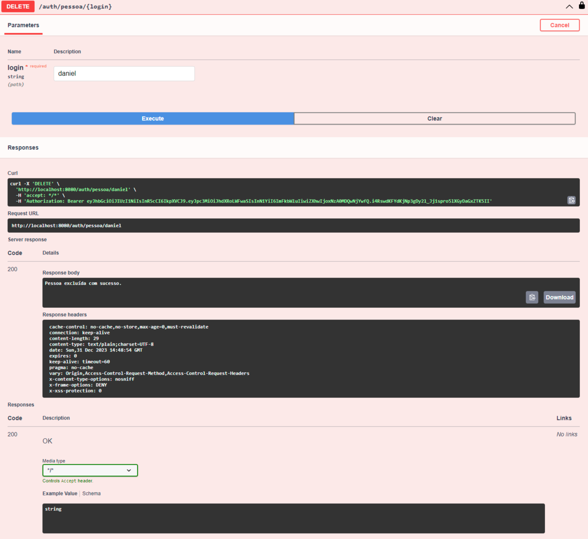
<br><br>
- Atualizando Pessoa pelo login autenticado como ADMIN <br><br>

```
http://localhost:8080/auth/pessoa/{login}
```
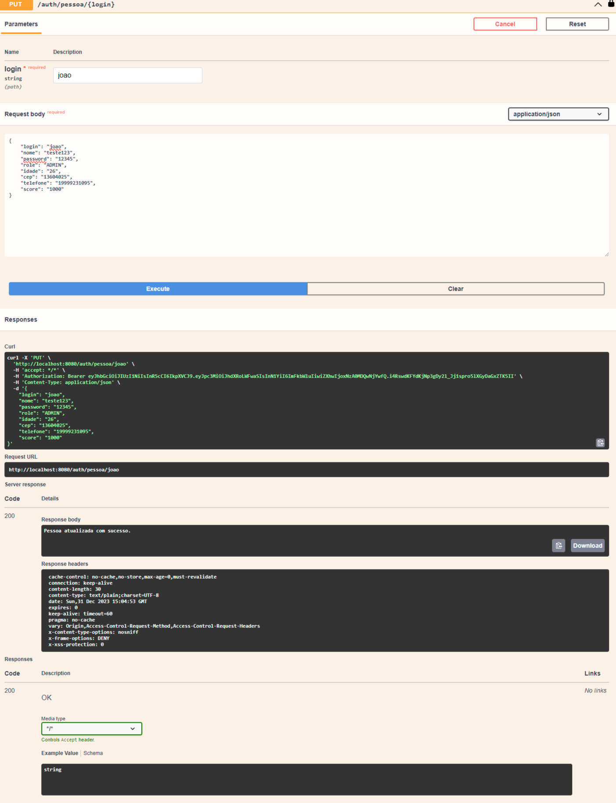
<br><br>
- Buscando Pessoa com cep invalido 404 <br><br>


<br><br>
- Falha ao tentar registrar pessoa com token USER 403 <br><br>

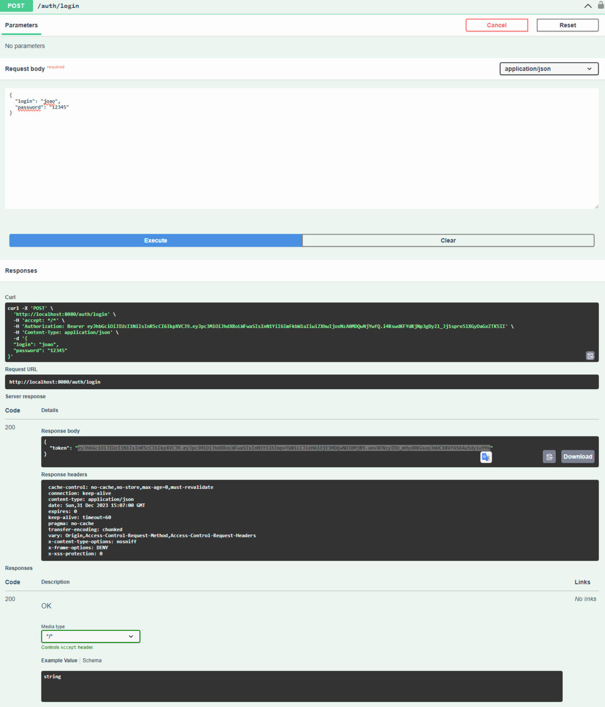
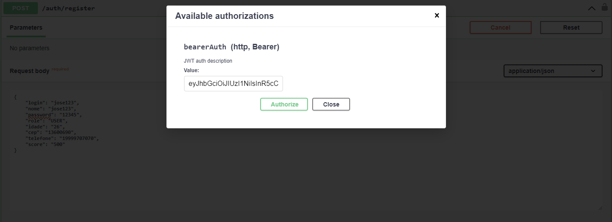
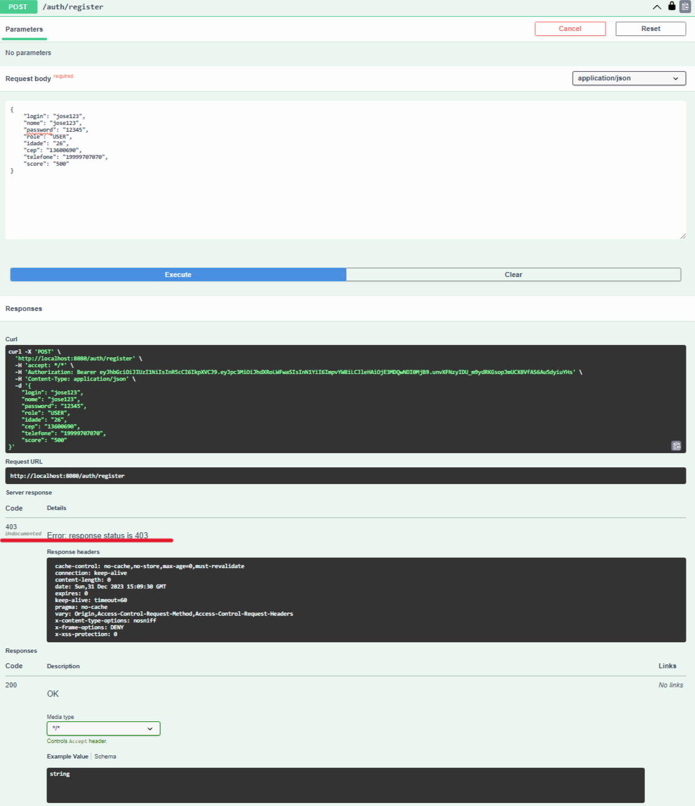
